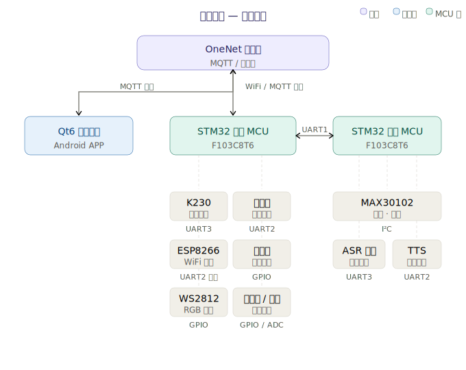

# SmartMedicineCabinet — 智能药柜系统

基于双 STM32 主从架构的智能药柜管理系统，集成 AI 视觉、语音交互、健康监测与云端物联，配套 Qt6 Android 移动端应用。

## 系统架构



**主机 MCU**：负责通信协调，连接 K230 人脸识别、条码扫描、ESP8266 WiFi 上云、药柜锁控、RGB 灯光

**从机 MCU**：专注健康监测与语音交互，连接 MAX30102 心率血氧、语音识别、语音合成

**Qt6 APP**：Android 移动端应用，通过 OneNet MQTT 实时监控药柜状态与健康数据

## 硬件清单

| 模块 | 型号 | 接口 | 功能 |
|------|------|------|------|
| 主控 | STM32F103C8T6 ×2 | — | 双 MCU 主从协同 |
| AI 视觉 | K230 | UART3 | 人脸识别、二维码识别 |
| WiFi | ESP8266 | UART2 | OneNet MQTT 通信 |
| 心率血氧 | MAX30102 | I2C | 光电容积脉搏波检测 |
| 语音识别 | 天问 51 ASR | UART3 | 离线语音命令 |
| 语音合成 | TTS 模块 | UART2 | 中文语音播报 |
| 条码扫描 | 扫码枪 | UART2 | 药品条码识别 |
| 药柜锁 | 继电器 ×2 | GPIO | 电磁锁开闭控制 |
| 照明 | WS2812 ×30 | GPIO | RGB 可编程氛围灯 |
| 人体检测 | HC-SR04 超声波 | GPIO | 人员接近感知 |
| 环境光 | 光敏电阻 | ADC | 环境亮度检测 |

## 项目结构

```
SmartMedicineCabinet/
├── MCU_Master/          # 主机 STM32 固件 (Keil MDK)
│   ├── Core/Src/        # HAL 库初始化和中断
│   ├── app/             # 应用状态机调度器
│   ├── driver/          # 外设驱动 (继电器/超声波/WS2812)
│   └── module/          # 功能模块 (ESP8266/云端协议)
├── MCU_Slave/           # 从机 STM32 固件 (Keil MDK)
│   ├── Core/Src/        # HAL 库初始化和中断
│   ├── app/             # 从机任务调度器
│   ├── driver/          # 传感器驱动 (MAX30102 I2C)
│   └── module/          # 功能模块 (健康算法/ASR/TTS)
├── src/                 # Qt6 C++ 后端
│   ├── mqttclient       # OneNet MQTT 3.1.1 客户端
│   ├── appstate         # 全局状态管理 (C++↔QML)
│   ├── databasemanager  # SQLite 本地数据库
│   └── theme            # UI 主题配置
├── qml/                 # QML 前端界面
│   ├── pages/           # 11 个应用页面
│   └── components/      # 可复用组件
├── main.qml             # 应用根组件
├── main.cpp             # Qt6 入口
├── CMakeLists.txt       # CMake 构建配置
└── BUILD_GUIDE.html     # 构建与部署指南
```

## 核心功能

### 药柜端 (STM32)

- **多种开柜方式**：人脸识别、语音命令、条码扫描、云端远程
- **健康检测**：心率、血氧饱和度实时采集
- **智能环境感知**：光线暗 + 有人靠近 → 自动亮灯
- **语音播报**：欢迎语、药品信息、健康数据 TTS 合成播报
- **OneNet 上云**：设备属性同步、远程控制指令接收
- **UART2 分时复用**：扫码枪 (9600bps) 与 ESP8266 (115200bps) 动态切换

### 移动端 (Qt6 Android APP)

- **实时仪表盘**：云端连接状态、药柜开闭状态、心率血氧概览
- **药品管理**：药品货架浏览、详情查看、购物车、下单
- **健康监测**：心率血氧数据可视化展示
- **用户系统**：SHA256 密码哈希、登录/注册、管理员权限
- **OneNet 物模型同步**：MQTT 属性上报/下发、设备影子

## 通信协议

| 链路 | 协议 | 波特率 | 用途 |
|------|------|--------|------|
| 主机 ↔ 从机 | 自定帧 (4 字节+XOR) | 115200 | 指令与健康数据 |
| 主机 ↔ K230 | 自定帧 | 115200 | 人脸识别结果 |
| 主机 ↔ ESP8266 | AT 命令 + JSON | 115200 | OneNet MQTT |
| 主机 ↔ 扫码枪 | ASCII | 9600 | 条码数据 |
| 从机 ↔ MAX30102 | 软件 I2C | 400kHz | 心率血氧数据 |
| 从机 ↔ ASR | UART | 9600 | 语音命令 |
| 从机 ↔ TTS | UART | 9600 | 语音合成 |
| APP ↔ OneNet | MQTT 3.1.1 | — | 设备数据/控制 |

## 快速开始

### MCU 固件

使用 Keil MDK 打开 `MCU_Master/SmartMedicineCabinet_Master.uvprojx` 和 `MCU_Slave/SmartMedicineCabinet_Slave.uvprojx`，编译下载到对应 STM32 开发板。

### Qt6 Android APP

环境要求：Qt 6.5+、Android NDK r26+、JDK 17、Android SDK API 34

详见 `BUILD_GUIDE.html`

## 许可证

MIT License
